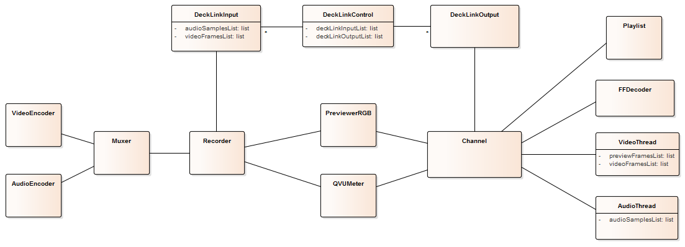

<p align="center">
  <a href="" rel="noopener">
 </a>
</p>

<h3 align="center">PowerVS</h3>

---

<p align="center"> PowerVS is a standalone broadcast video server based on ffmpeg
    <br> 
</p>

## 📝 Table of Contents
- [About](#about)
- [Getting Started](#getting_started)
- [Running the tests](#tests)
- [Usage](#usage)
- [Development](#development)
- [Deployment](#deployment)
- [Built Using](#built_using)
- [TODO](docs/TODO.md)
- [Authors](#authors)
- [Acknowledgments](#acknowledgement)

## 🧐 About <a name="about"></a>
The year was 2011, the broadcast company where I worked at needed to improve the production workflow, which at the time consisted in ingesting and recording hundreds of betacam tapes every week.

I took on the challenge to implement a playout server based on the then recent Blackmagic cards in order to speed up the process and taking advantage of the fact that everything was handled by digital files after the first ingest from the camera source.

The first engine I thought of implementing was ffmpeg but because we were using D10 IMX MXF files and also my lack of knowledge at the time on how ffmpeg worked, the first version came out using VLC as the decoding engine.

There were some limitations however on seeking files and lack of control, so I started working on a GStreamer solution that worked ok for a while also.

I ended up returning to ffmpeg after some more investigation and analysis of the ffmbc fork that is used for broadcast and created the functionality to also record files.

There were other contestant open-source solutions at the time like CasparCG, but none seemed to work correctly with broadcast formats.

This software has been running since 2012 with little to no bugs or issues. Development of new features stopped around 2018.

I spent much of my off time developing the software and I hope it will prove useful to others even if only for academic purposes :slightly_smiling_face:


## 🏁 Getting Started <a name="getting_started"></a>
These instructions will get you a copy of the project up and running on your local machine for development and testing purposes. See [deployment](#deployment) for notes on how to deploy the project on a live system.

### Prerequisites

```
Windows machine, tested on Windows 7 and 10

Blackmagic card, tested with:
	Decklink Duo 2
	Decklink Mini Monitor
	Decklink Mini Recorder
	Decklink Studio 4K
	UltraStudio SDI (USB 3.0)
```

### Installing
If you have a licensed copy of Visual Studio 2010, install it and then jump to the [Qt](#Qt) section

#### Compiler
1. Install [Visual C++ 2010 Express](https://archive.org/download/vs-2010-express-1/VS2010Express1.iso)
2. Uninstall any Visual C++ 2010 runtime/redistributable newer or equal to 10.0.30319 (Otherwise, it will cause a failure when installing Windows SDK)
3. Install [Windows SDK 7.1](https://www.microsoft.com/en-us/download/details.aspx?id=8442) (get the GRMSDKX_EN_DVD.iso and make sure to include headers, libraries, tools, compilers and the debugging tools). Make sure .NET framework 4.x is installed, installation of the WinSDK will not allow you to select compilers otherwise.
	- On Windows 10, there is an issue with the .NET framework, so you need to execute the setup from "Setup\SDKSetup.exe" to install the compilers and you may need to install the debugging tools after setup finishes from "Setup\WinSDKDebuggingTools\dbg_x86.exe"
4. Install [VS 2010 SP1](https://archive.org/download/vs-2010-sp-1dvd-1/VS2010SP1dvd1.iso) for the missing headers (this requires VS Express)
5. Install [MSVC 2010 SP1 Compiler Update](https://www.microsoft.com/en-au/download/details.aspx?id=4422) for the compiler fixes.

#### Qt <a name="Qt"></a>
1. Install [Qt 4.8](https://download.qt.io/archive/qt/4.8/4.8.7/qt-opensource-windows-x86-vs2010-4.8.7.exe)
2. Install [Qt Creator](https://download.qt.io/official_releases/qtcreator/4.15/4.15.0/qt-creator-opensource-windows-x86_64-4.15.0.exe)

#### PowerVS Core submodule
If your git client does not download the contents of the PowerVS Core submodule, issue the following command:

```
git submodule update --init --recursive
```

Open the [PowerVS.pro](https://github.com/alfredosilvestre/powervs/tree/master/PowerVS.pro) file in Qt Creator and build using the standard process.

## 🔧 Running the tests <a name="tests"></a>
Sadly, no automated tests were created yet since you need a physical card to test all the functionalities, usually you should have a folder with several test video files and run them through the GUI.

## 🎈 Usage <a name="usage"></a>
PowerVS allows the playout and ingest of different file formats and supports two SDI/HDMI video channels.
The interface has two independent playlists, one for each channel.
There is also a bridge mode that will clone one input to the other channel allowing the recording of two files for the same input source useful for example if you need to record the source and add an overlay on the other file.

### Caracteristics
- Supported resolutions: 625/25 PAL, 720p50, 720p59.94, 1080i50 e 1080i59.94 with software Up/Down conversion
- Video output: SDI 10bit 4:2:2
- Audio output: Embedded SDI audio 24 bit 48 kHz Stereo, up to 8 channels
- Video reference: Blackburst or Tri-sync
- Supported file formats for playout: MPG, AVI, MP4, MOV, OGG, MKV, MXF
- Tested playout codecs: IMX 30 e 50 Mbits, DV, P2, h264, Theora, MPEG-2, MPEG-4, XDCAM HD, XDCAM EX

### Interface functionalities
- Add/remove and organize clips in the playlists
- Save and load playlists
- Chain playlist items (block play supported by selecting items to block chain)
- Loop playlist or clip
- Clip time visualization and timecode if available
- Audio visualization up to 8 channels (2 at a time)
- PAL aspect ratio 4x3 and 16x9
- Fast-forward and slow motion option
- Send embedded VITC and VANC on SDI cards (SD resolution only)
- Fill+Key option to reproduce two simultaneous channels
- Option to add a CG item overlay on the video, for example a "bug" logo

### Basic shortcuts
- Ctrl+Shift+F12 -> Access settings menu
- F1 -> Take on channel A
- F2 -> Drop on channel A
- F3 -> Recue on channel A
- F4 -> Activate/deactivate loop on channel A
- F5 -> Activate/deactivate chain on playlist A
- F6 -> Activate/deactivate loop on playlist A (chain must be activated)
- F7 -> Activate/deactivate chain on playlist B
- F8 -> Activate/deactivate loop on playlist B (chain must be activated)
- F9 -> Take on channel B
- F10 -> Drop on channel B
- F11 -> Recue on channel B
- F12 -> Activate/deactivate loop on channel B
- \+ -> Take fill+key
- \- -> Drop fill+key

## :thought_balloon: Development <a name="development"></a>
Check below an overview of the class relationships

</a>

### Available Defines

* DECKLINK - Enables Decklink code
* GUI - Enables Graphic User Interface code
* PORTAUDIO - Enables audio output for internal audio card

## 🚀 Deployment <a name="deployment"></a>
You just need to install [Microsoft Visual C++ 2010 Redistributable Package](https://download.microsoft.com/download/1/6/5/165255E7-1014-4D0A-B094-B6A430A6BFFC/vcredist_x86.exe)
You should also copy the Qt, ffmpeg, portaudio and log4cxx shared libraries to the same location (check the [releases](https://github.com/alfredosilvestre/powervs/releases) for examples).

## ⛏️ Built Using <a name="built_using"></a>
- [Qt 4.8](https://doc.qt.io/archives/qt-4.8/index.html) - Application development framework
- [FFmpeg](https://www.ffmpeg.org/) - Video/Audio encoding/decoding framework
- [Blackmagic](https://www.blackmagicdesign.com/) - Decklink SDK
- [PortAudio](https://github.com/PortAudio/portaudio/) - Real-time audio I/O library
- [Log4cxx](https://logging.apache.org/log4cxx/) - Logging framework

## ✍️ Authors <a name="authors"></a>
- [@alfredosilvestre](https://github.com/alfredosilvestre)


## 🎉 Acknowledgements <a name="acknowledgement"></a>
- [@kylelobo](https://github.com/kylelobo) - For this doc template :slightly_smiling_face:
- [@aescande](https://github.com/aescande) - For the log4cxx build (forked it [here](https://github.com/alfredosilvestre/log4cxxWin32) also)
- [@bcoudurier](https://github.com/bcoudurier) - For the FFmbc fork that made it possible for me to create the recording functionality
- [@brandaopaulo](https://github.com/brandaopaulo) - For the opportunity to work on this project
